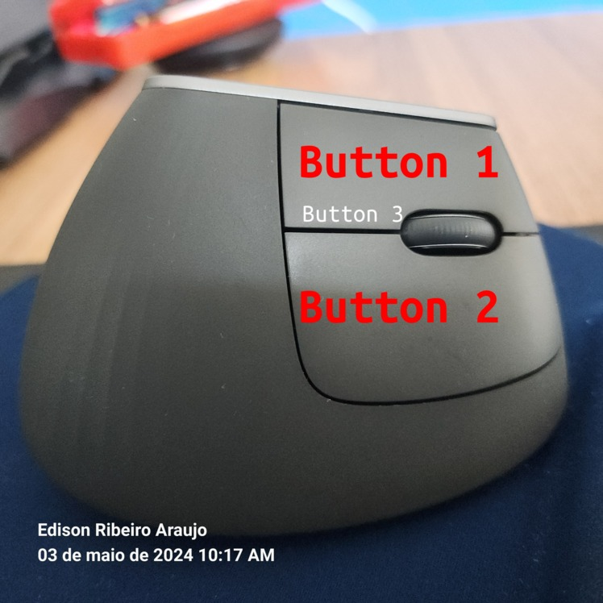
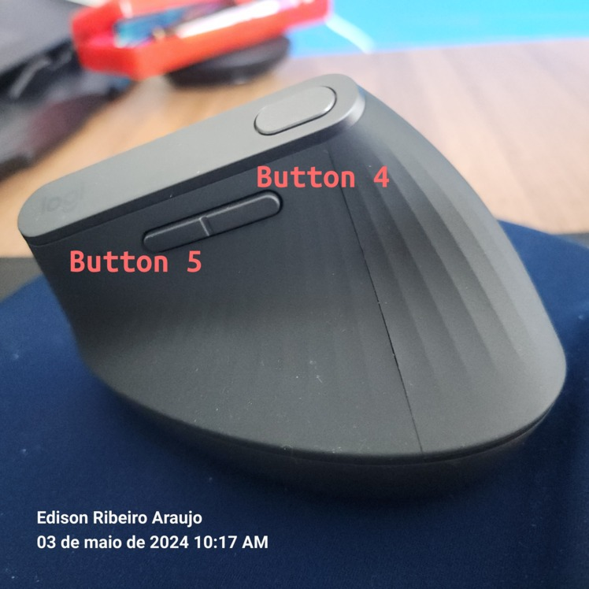

# Get Butons Of LogtechMxVertical Mouse On Linux With Java

I Like so much of Java and Linux.

The default use of this mouse is Windows and MacOSX.

This mouse is not full used in Linux but I read this article:

https://www.baeldung.com/linux/mouse-events-input-event-interface

And other for add ...

* https://wiki.archlinux.org/title/Logitech_MX_Master
* https://michael-verschoof.medium.com/setting-up-mx-master-mouse-on-linux-aae0e2ce3962
* https://zue.ge/using-logiops-to-configure-the-mx-master-3-on-linux/
* https://wiki.archlinux.org/title/Logitech_MX_Master
* https://linux-hardware.org/?id=usb:046d-c08a
* https://askubuntu.com/questions/1122259/logitech-mouse-mx-vertical-ubuntu-18-software


Code of Linux for undestand it message structure:

  * https://github.com/torvalds/linux/blob/v5.5-rc5/include/uapi/linux/input.h#L30

Structure of timeval em c++:

  * https://man7.org/linux/man-pages/man3/timeval.3type.html


Mouse used
----------
* https://tendinfo.com.br/mouse-logitech-mx-vertical-910-005447

* 


And I see this video:
https://www.youtube.com/watch?v=a8w71o8YB0g


And with this, i decide make this project for make 6 diferents tasks (as shortcuts) on my linux.

Simple Project for Make shotcuts using moving and click alternatives keys.

I have any application then use click buttons, for example: Firefox for "go next" and "go previus".

But I no have events for others application as xterm. Becase this and I'll use mouse and application (or name of window).

Ok, but how can found current application for where is mouse pointer? The solution is xdotool program.

With it we can make action mouse buttons with application used/focused.

Then I can think in application with actions as

```
"Configuration":{
  "delayMaxBetweenClickAndLeave":"100ms",
  "delayMaxBetweenClicks": "350ms",
  "NoWindows": {
     "OnClickButton1": {
     "ignore":false,
     "run":"IntelliJ"
     }
  },
  
  "Window Name Application RegExp" : {
    "OnClickButton1" : {
        "ignore": false,
        "run" : "Program to execute"
     }
  }
}
```

For do no have doubts: I show number of buttons used in this project





With this configuration, I can test with simple click button.

### Examples with xdotools.

 * Get title of windows focused or active window :

``` xdotool getactivewindow getwindowname ```

 * Get pid of process this windows

``` xdotool getactivewindow getwindowpid ```


Shorcuts :
----------

### Click button 1 and Go Rigth ->
### Click button 1 and Go Left  ->
### Click button 1 and Go Up    ->
### Click button 1 and Go Down  ->
### Click button 1              ->
### Click button 2              -> 
### Double click on button 1    ->
### Double click on button 2    ->
### Tiple click on button 1     ->

This is a service make with Java and runing as root or input user.

Use cases :
-----------

 * #### Use Cases 1 - Start Program
   * -> Start as Service ...
   * -> Read configuration file
   * -> Read What event file is connected
   * -> Loop while (true)
   * -> If receive kill exit of loop

 * #### Use Cases 2 - Go Left
   * ->
   * 
 * #### Use Case 3 - Go Rigth
   * ->
   * 
 * #### Use Case 4 - Go Up
   * ->
   * 

  * #### Use Case 5 - Go Down

  * #### Use Case 6 - Click Button 1 (only)

  * #### Use Case 7 - Click Button 2

  * #### Use Case 7 - Exit

Dependencies.
------------
* Java 21
* evemu-tools
* evtest
* xdotools

